# README

This is the repository template used for student repositories in LAPR Projets.

#Domain-Model
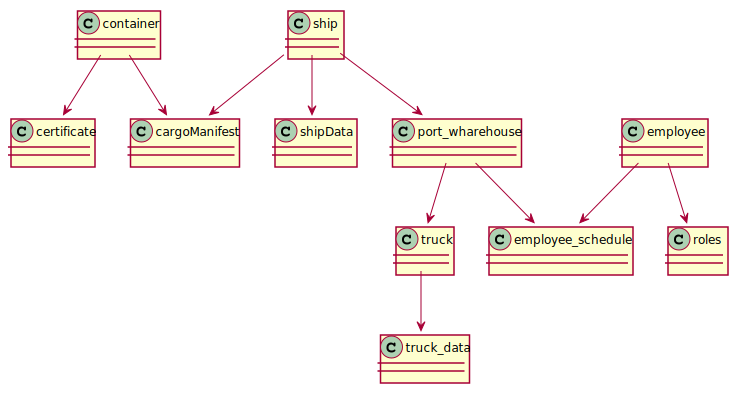

#Class-Diagram
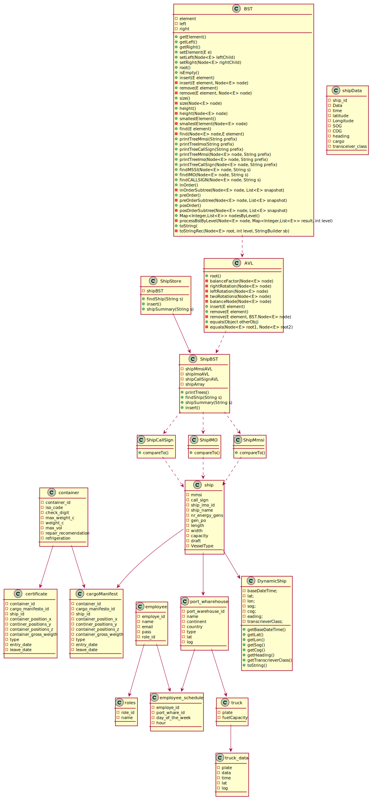

#US101
###SD
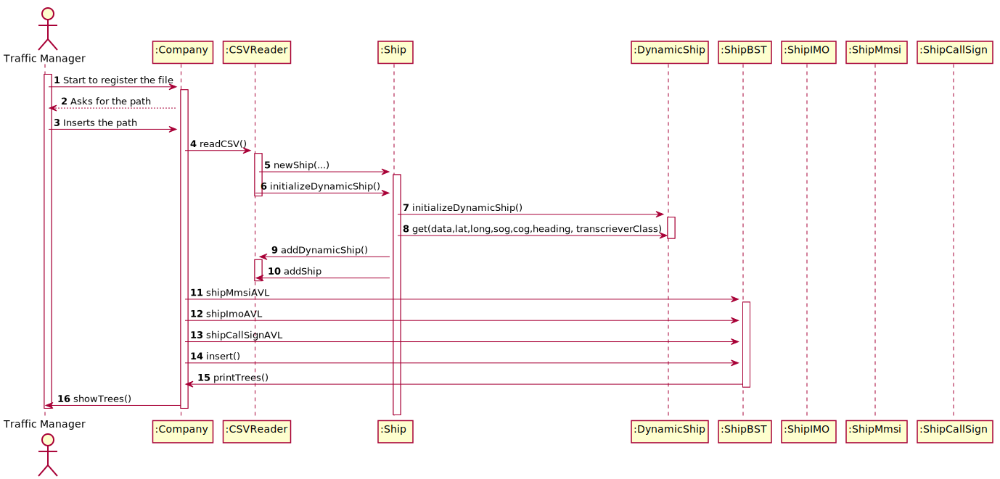

###CD
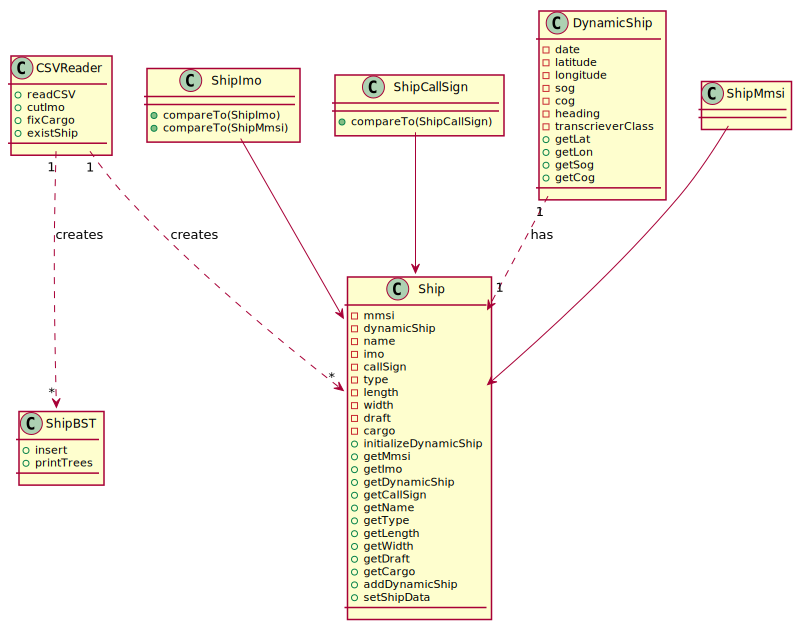
###MD
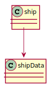

#US102
###SSD
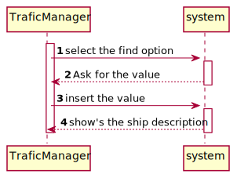

###SD
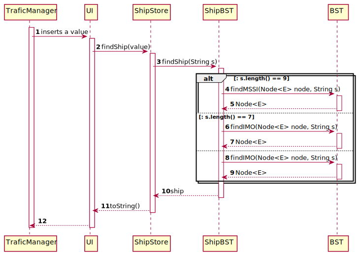
###CD
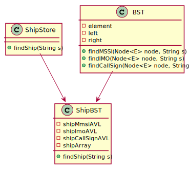
###MD
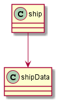

#US103
###SD
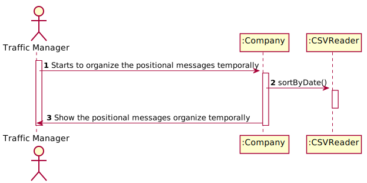

###CD
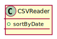

###MD

#US104
###SSD
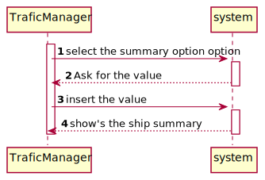
###SD
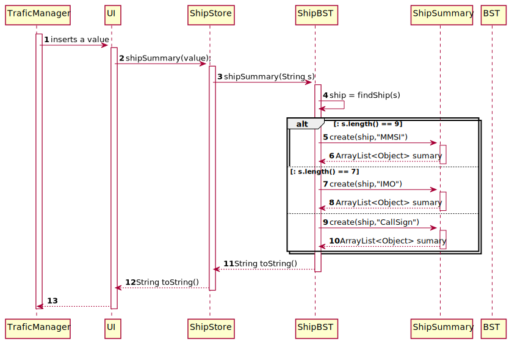
###CD
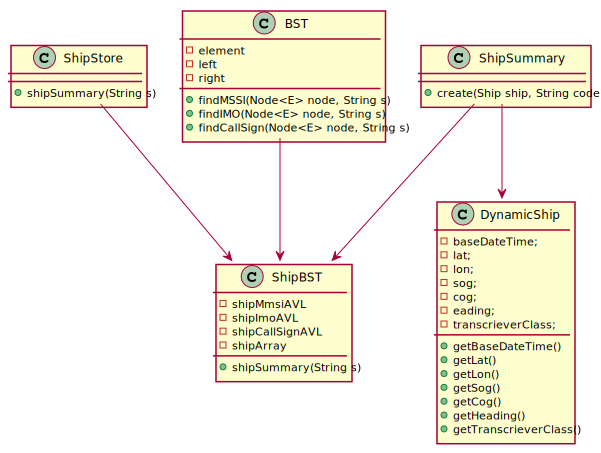
###MD
