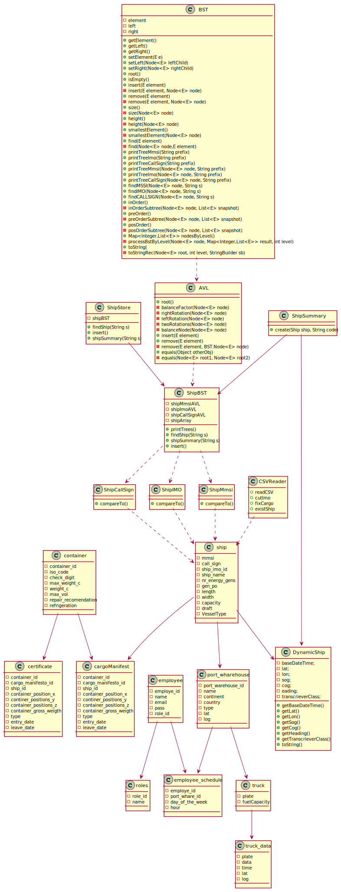
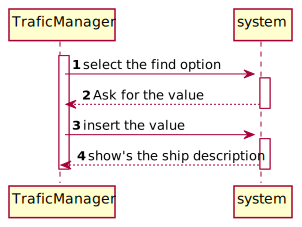

# README

This is the repository template used for student repositories in LAPR Projets.

#Domain-Model

#Class-Diagram

#US101
###SD

###CD

###MD

#US102
###SSD

###SD

###CD

###MD

#US103
###SD

###CD

###MD

#US104
###SSD

###SD

###CD

###MD
